# 🧬HACGA1 Software Documentation

The HACGA1 software package efficiently integrates various bioinformatics tools through a Python-based pipeline. By utilizing function calls and command-line execution, it automates the entire workflow from data preprocessing to genome annotation

**Author Information**  

- **Qiqi Liang*** (First Author, Corresponding Author of the related manuscript)  
- Additional authors will be added later.

---

This manual contains the following contents:

- **Principle Explanation** : Provide a detailed introduction to the design concept, working mechanism, and application principle of HACGA1 in genomic annotation.
- **Installation Method** : Guide users to install software and deploy processes in a Linux system environment (CentOS is recommended).
- **Dependency Environment Configuration** : List and explain the configuration methods of the required software dependencies, Python packages, and third-party tools to ensure the smooth operation of the process.
- **Instructions for Use** : Provide a complete operation process example from input data preparation to result parsing to help users get started quickly.

By reading this manual, users can efficiently complete genomic annotation analysis on a Linux system (CentOS7 is recommended), thereby achieving automated processing of gene prediction, structural annotation and multi-dimensional data integration.

---

## Principles and Overview of the HACGA1

The development logic of HACGA1 begins with the preprocessing of genomic data. Specifically, the function split_fasta_by_length() partitions large genomes into smaller segments (e.g., 100 kb) to facilitate parallel processing in subsequent steps, thereby significantly improving computational efficiency. These segmented sequences are then used as inputs for downstream analytical modules. During the transcript assembly process, HACGA1 utilizes the RNADenovo module for analysis. This module employs the subprocess.run function to execute the StringTie tool, which assembles transcripts using alignment information from the input BAM file and outputs the results in GTF format. Subsequently, the TransDecoder tool is applied to identify long open reading frames (ORFs) within the assembled transcripts, thereby predicting potential coding regions. Subsequently, during the gene prediction stage, HACGA1 employs three tools (AUGUSTUS, GlimmerHMM, and GeneMark-ET) to predict gene boundaries. By invoking the corresponding functions (augustus, glimmerhmm, and genemarket), the pipeline executes command-line calls to each tool, integrating multi-dimensional gene predictions derived from different algorithmic approaches. RNA-seq data is further incorporated to enhance prediction accuracy. For RNA-seq data processing, HACGA1 first generates preliminary transcript assemblies via the RNADenovo module, followed by transcript refinement using the trinity_pasa module to ensure high precision in the final gene structures. These operations are similarly executed via the subprocess.run function for command-line automation. Each step in the entire workflow follows a standardized design, ensuring seamless data transfer between modules and eliminating the need for manual intervention. During execution, the Python script utilizes the subprocess module to invoke external tools and incorporates error-handling mechanisms to ensure fault tolerance. For example, if StringTie fails, the script logs the error and continues with subsequent analytical steps without interruption. This approach prevents workflow disruptions and enhances the overall robustness of the system. Additionally, HACGA1 integrates the SLURM job scheduling system to improve analytical efficiency through distributed computing clusters. By leveraging SLURM for task scheduling, HACGA1 enables parallel execution across multiple compute nodes. This capability is especially beneficial when processing large-scale genomic data, as it allows for efficient allocation of computational resources and significantly reduces overall processing time.

During the execution process, HACGA1 utilizes Hisat2 and StringTie2 to align and assemble RNA-seq data, producing an initial set of transcript annotations that are subsequently filtered using custom scripts. GeneMark-ET is then employed for de novo gene structure prediction, generating the first set of gene predictions. In parallel, RNA-seq data is assembled into transcripts using Trinity and further analyzed through the PASA pipeline. If Iso-Seq (full-length transcriptome) data is available, SMRTLink is used to generate high-quality full-length transcripts, which serve to validate and refine the RNA-seq-based assemblies. These integrated, high-quality transcripts undergo preliminary open reading frame (ORF) prediction with PASA, resulting in an annotated gene structure file. Subsequently, based on the PASA-derived annotations, gene structures are predicted using both AUGUSTUS and GlimmerHMM, producing the second and third sets of predictions, respectively. For homology-based prediction, high-quality homologous protein sequences are obtained either from the OrthoDB v10 database or from a curated set of protein sequences that includes model organisms and closely related species relevant to the target organism being annotated. These sequences, along with the reference genome, are analyzed using GeneMark-EP+, which identifies exon-intron boundaries and other structural features to produce the fourth set of gene predictions.

Finally, EvidenceModeler (EVM) integrates all the aforementioned evidence (including ab initio predictions, transcriptomic support, and homologous protein alignments), using specified weighting values to generate consolidated gene models. These models are further processed and refined with PASA to annotate untranslated regions (UTRs) and alternative splicing events, ensuring the final gene set exhibits high completeness.

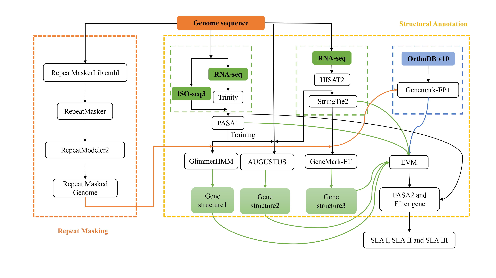

<figure style="text-align: center;">
  <figcaption><strong>Figure 1. Schematic diagram of the HACGA1 structural annotation pipeline</strong></figcaption>
</figure>

------

## Getting Started

### Installing HACGA1

```bash
# Get the code
git clone https://github.com/liqianQ1/annotation_gene.git
cd annotation_gene

# Create Conda environment and install dependencies
conda create -n ann python=3.12.0 -y
conda activate ann
```

### Installing Dependencies via Conda

| Tool                  | Functionality                                             |
| --------------------- | --------------------------------------------------------- |
| hisat2                | Align RNA-seq data to the genome                          |
| stringtie             | Transcriptome assembly and quantification                 |
| transdecoder          | Predict protein-coding sequences from transcripts         |
| gffread               | GFF/GTF file operations and format conversions            |
| pasa                  | Integrate protein/transcript evidence, update gene models |
| augustus              | Ab initio gene prediction                                 |
| bam2hints             | Generate hints files for Augustus (bundled)               |
| glimmerhmm            | Ab initio gene prediction                                 |
| evidencemodeler (EVM) | Integrate evidence into final annotation models           |

Installation example:

```bash
conda install -c bioconda hisat2 -y
conda install -c bioconda stringtie -y
conda install -c bioconda transdecoder -y
conda install -c bioconda gffread -y
conda install -c bioconda pasa -y
conda install -c bioconda augustus -y
conda install -c bioconda glimmerhmm -y
conda install -c bioconda evidencemodeler -y
```

------

## GeneMarkS / GeneMark-ES

This software must be downloaded from the official website:

- Download link: [GeneMark Download Page](https://genemark.bme.gatech.edu/GeneMark/license_download.cgi)
- Register, download, extract, and configure environment variables:

```bash
export PATH=/path/to/gm_et_linux_64:$PATH
```

------

## Slurm Configuration (Optional)

It is recommended to use the Slurm workload manager for task scheduling and acceleration.
Refer to the [Slurm installation tutorial](https://www.schedmd.com/slurm/installation-tutorial/) for setup.

------

## Configuring HACGA1

Configuration file path:

```
config/config.txt
```

Example configuration:

```txt
hisat2-build       = Anaconda3/envs/ann/bin/hisat2-build
python2            = /usr/bin/python2
slurm              = Pipeline/slurm/slurm_Duty.pl
queue              = q_all
transdecoder       = Anaconda3/envs/ann/opt/transdecoder
stringtie          = Anaconda3/envs/ann/bin/stringtie
gffread            = Anaconda3/envs/ann/bin/gffread
pasa               = Anaconda3/envs/ann/opt/pasa-2.5.2
augustus           = Anaconda3/envs/ann/bin/augustus
bam2hints          = Anaconda3/envs/ann/bin/bam2hints
augustus_extrinsic = Anaconda3/envs/ann/config/extrinsic/extrinsic.M.RM.E.W.cfg
gmes               = Software/gmes_linux_64_4
perl               = Anaconda3/envs/ann/bin/perl
trainGlimmerHMM    = Anaconda3/envs/ann/bin/trainGlimmerHMM
glimmerhmm         = Anaconda3/envs/ann/bin/glimmerhmm
evidencemodeler    = Anaconda3/envs/ann/opt/evidencemodeler-2.1.0
```

------

## HACGA1 Usage

### 1. Input Files

HACGA1 requires the following input files:

1. **Input sequences (3 types):**
   - Genome sequence
   - Genome repeat annotation sequence
   - Trinity-assembled RNA sequences

2. **Auxiliary annotation files (5 files):**
   - **EST.tab**  
     - Two columns, tab-delimited  
     - Column 1: Sample name  
     - Column 2: Absolute path to the Trinity-assembled RNA sequence
   - **RNAseq.tab**  
     - Three columns, tab-delimited  
     - Column 1: Sample name  
     - Column 2: Absolute path to RNA-seq Read 1  
     - Column 3: Absolute path to RNA-seq Read 2  
     - Purpose: Provides a full list of samples with paths to raw sequencing data
   - **homolog.tab**  
     - Two columns, tab-delimited  
     - Column 1: Sample name  
     - Column 2: Absolute path to protein sequence data for homology-based annotation
   - **genome.tab**  
     - Four columns, tab-delimited  
     - Column 1 & 2: Sample name  
     - Column 3: Absolute path to genome sequence  
     - Column 4: Absolute path to genome repeat annotation sequence
   - **weights.txt**  
     - Three columns: evidence category, type, and weight  
     - **Evidence categories**: `ABINITIO_PREDICTION`, `PROTEIN`, `TRANSCRIPT`  
     - **Types**: `GeneMark.hmm`, `GeneMark.hmmET`, `AUGUSTUS`, `GlimmerHMM`, `StringTie`, `transdecoder`  
     - **Weight principle**: Transcript evidence (pasa) >> Homology evidence ≥ Ab initio prediction

### 2. Workflow Execution

When using the software, simply provide the required input files and submit them to the node, and the gene structure annotation will be completed automatically.

Example command:

```bash
python /pipline/annotation_gene/ann_gene.py \
  --Outputdir $PWD/ \
  --Genome tab/genome.tab \
  --Homolog tab/homolog.tab \
  --RNAseq tab/RNAseq.tab \
  --EST tab/EST.tab \
  --config /pipline/annotation_gene/config/config.txt
```
Interpretation of Software Input Parameters:

--Outputdir: Specifies the output directory for results. An absolute path should be provided.

--Genome: Refers to the genome species and sequence information, which must be configured in a designated configuration file.

--Homolog: Indicates the file path to the reference protein sequences used for genome annotation.

--RNAseq: Specifies the file path to the RNA-seq data used in the annotation process.

--EST: Provides the file path to the expressed sequence tags (EST) or full-length transcript sequences (e.g., Iso-Seq data) for annotation.

--config: used to specify the path to the configuration file.

Upon completion of the workflow, users will obtain GFF files containing gene structure annotations supported by multiple lines of evidence, along with corresponding nucleotide and protein sequence files.

------

## Introduction to the results of HACGA1 operation

During the execution of the pipeline, the system automatically creates multiple directories in a predefined order, including 01RNAdenovo, 02trinity_pasa, 03augustus, 04genemarket, 05genemarkep, 06glimmerhmm, 07evm, and 08evm_pasa. Within each directory, the corresponding computational tasks are performed autonomously (Fig 2).

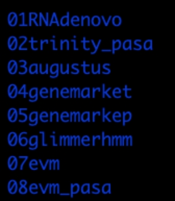 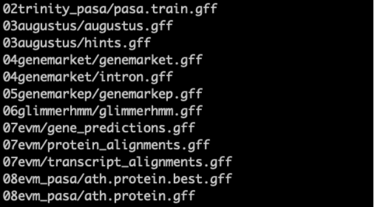 

 <figure style="text-align: center;">
  <figcaption><strong>Figure 2. Software calculations and output result catalog</strong></figcaption>
</figure>

In the 01RNAdenovo directory, the subdirectories 01_index, 02_hisat2, and 03_stringtie are automatically generated. These correspond to the steps of reference genome indexing preparation, sequence alignment, and transcript assembly and annotation, respectively. StringTie2 generates a transcript structure annotation file (merge.stringtie.assemble.gtf) and a sequence file (transcripts.fasta). The final output, RNADenovo.gff, serves as the transcript annotation file derived from RNA-seq-based assembly ( Figure 3).

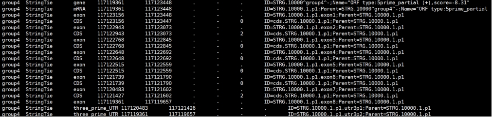 

  <figure style="text-align: center;">
  <figcaption><strong>Figure 3. Example content of the RNADenovo.gff genome annotation file</strong></figcaption>
</figure>

The 02trinity_pasa directory contains the complete set of files for transcript assembly and annotation using the PASA pipeline. The workflow is divided into two main functional modules. The first module handles sequence alignment and includes the following files: gmap.spliced_alignments.gff3 (results from GMAP), minimap2.spliced_alignments.gff3 (results from Minimap2), and blat.spliced_alignments.gff3 (results from BLAT).The second module comprises the core output files from the assembly process, which consist of: pasa_cotton.assemblies.fasta (assembled transcript sequences), pasa_cotton.pasa_assemblies.gff3/bed/gtf (annotation files in three formats), pasa_cotton.pasa_assemblies_described.txt (assembly description file), as well as protein sequences, CDS sequences, and genomic coordinate annotation files predicted by TransDecoder. The final annotation file pasa.1.end.gff (Fig. 4) represents the predicted gene structures based on the assembled transcript sequences.

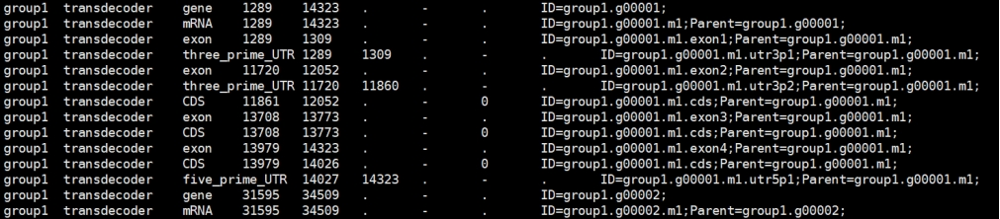 

 <figure style="text-align: center;">
  <figcaption><strong>Figure 4. Example content of the pasa.1.end.gff genome annotation file</strong></figcaption>
</figure>

The 03augustus directory contains the runtime files and training data for the Augustus gene prediction tool, along with its core scripts and output files. Key components include: hints.gff (incorporating external evidence such as RNA-seq or homologous protein alignments), execution scripts such as all.shell, hints.gff.sh, and augustus.gff.sh, as well as output results: augustus.gff (final gene prediction annotations), augustus.out (raw output), and stat.out (statistical report). Among these, augustus.gff (Fig. 5) represents the final de novo predicted gene structures.

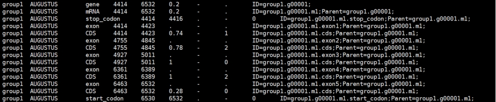 

 <figure style="text-align: center;">
  <figcaption><strong>Figure 5. Example content of the augustus.gff genome annotation file</strong></figcaption>
</figure>

The folder "04genemarket" contains the complete set of executable files and data for the GeneMark-ET/ES gene prediction pipeline, which is primarily used to predict and annotate protein-coding genes in the target species. The main directory includes core input and output files: intron.gff (intron prediction results), run.cfg (parameter configuration file), gmhmm.mod (the trained Hidden Markov Model), and the final prediction output genemark.gff (annotated gene structures). The subdirectory output stores the optimized prediction model gmhmm.mod; the info subdirectory records detailed logs of the training and prediction processes (e.g., dna.gc.csv for GC content statistics, training.trace for tracking model iterations); the run subdirectory contains model files from stage-specific training steps; and the data subdirectory provides input data, including the genome sequence dna.fna, external evidence et.gff, and the training set training.fna. Ultimately, genemarket.gff (Fig. 6) serves as the final transcriptome-based annotation file for gene structures.

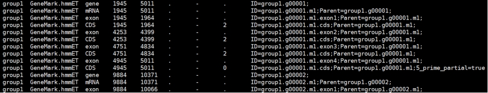 

 <figure style="text-align: center;">
  <figcaption><strong>Figure 6. Example content of the augustus.gff genome annotation file</strong></figcaption>
</figure>

The folder "05genemarkep" contains the complete analysis pipeline files for GeneMark-ES/EP, a gene prediction tool that utilizes self-training and external evidence. Key components include the genome sequence (dna.fna), the training set (training.fna), and external evidence files (such as prothint.gff, ep.gff, and plus.gff) located in the data subdirectory. Model training files, including stage-specific Hidden Markov Model files, are stored in the run subdirectory. The main directory contains prediction outputs: genemark_es.gtf (prediction in ES mode) and genemarkep.gff (prediction in EP mode), along with the statistical report stat.out. The prothint subdirectory stores homologous protein alignment evidence (e.g., diamond.out, spaln.gff) used to enhance prediction accuracy. The file genemarkep.gff (Fig. 7) serves as the final gene structure annotation file generated based on the protein reference set.

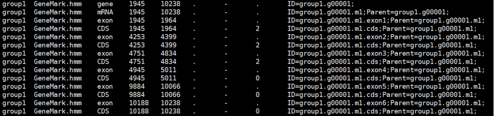 

  <figure style="text-align: center;">
  <figcaption><strong>Figure 7. Example content of the genemarkep.gff genome annotation file </strong></figcaption>
</figure>

The folder "06glimmerhmm" contains the complete set of running files for the gene prediction tool GlimmerHMM. The main directory includes core scripts and result files: glimmerhmm.gff.sh, glimmerhmm.out (raw output), and stat.out (statistical report). The train subdirectory contains training data and model files: cds_00.fa and cds_01.fa serve as coding sequences for training, while generate_glimmer_scripts.sh and run.sh control the training workflow. The new_00 subdirectory stores model files generated during training (e.g., coding_0_40.model and noncoding_40_100.model), as well as key parameter files such as exons.dat (recording exon features), acc/don.errors (documenting splice site error rates), and atg/stop.markov (Modeling start and stop codon sequences). The file glimmerhmm.gff (Fig. 8) represents the final de novo predicted gene structures.

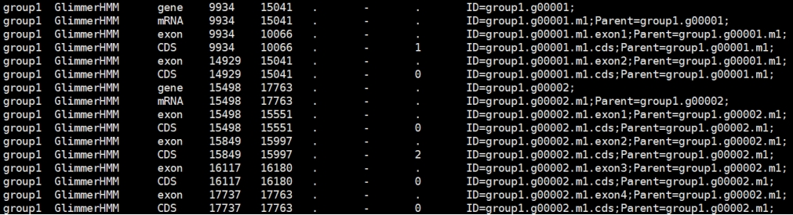 

  <figure style="text-align: center;">
  <figcaption><strong>Figure 8. Example content of the glimmerhmm.gff genome annotation file </strong></figcaption>
</figure>

The folder "07evm" contains the complete dataset for the EVM gene prediction integration pipeline, which combines multiple lines of evidence (including Protein alignment, transcript, gene prediction) to generate the final gene annotation for cotton. The main directory includes core input files: protein_alignments.gff (homology-based protein alignment evidence), transcript_alignments.gff (RNA-seq transcript alignments), gene_predictions.gff (predictions from tools such as Augustus and GeneMark), along with the configuration file weights.txt (evidence weighting parameters) and the script commands.sh. During execution, the evidence data are partitioned by genomic coordinates into segments (e.g., group3_1-10000000) to improve computational efficiency. The final integrated gene models are output as evm.out.gff3. Subdirectories (e.g., group3/ and ptg000162l/) correspond to analyses for specific chromosomes or scaffolds, each containing input evidence files, the reference genome sequence (cottons.racon.2.adjust.fa), and partitioned results. The file evm.gff3 (Fig. 9) represents the final consensus gene structures integrated by EVM from multiple prediction sources.

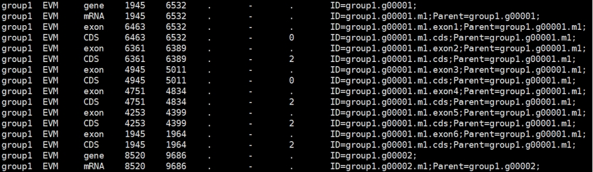 

  <figure style="text-align: center;">
  <figcaption><strong>Figure 9. Example content of the evm.gff3 genome annotation file</strong></figcaption>
</figure>

The folder "08evm_pasa" contains the complete workflow files for the integrated analysis using EVM and PASA, aimed at generating high-confidence annotations for the cotton genome by combining multiple sources of evidence. Key files include: evm_pasa.end.sh (the main control script) and the PASA configuration files (alignAssembly.config and annotationCompare.config), which guide evidence integration and gene model refinement. Outputs comprise PASA-corrected gene structures, optimal protein predictions, and statistical reports such as protein.best.gff.stat.out and Genes_annotation.statistics.xls (for annotation quality assessment). This workflow successfully integrates protein homology, transcript alignments, and other evidence to produce a reliable genome annotation validated by PASA. The file protein.best.gff (Fig. 10) represents the final integrated gene annotation generated by this process.

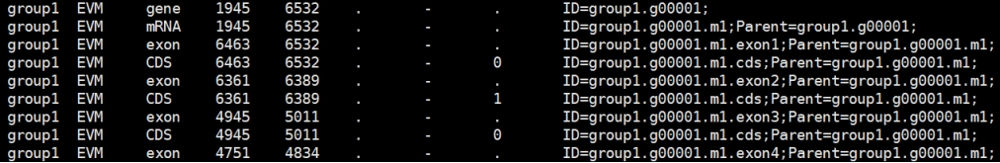 

   <figure style="text-align: center;">
  <figcaption><strong>Figure 10. Example content of the protein.best.gff genome annotation file</strong></figcaption>
</figure>

These annotation files collectively provide comprehensive data support for the refinement and validation of gene structures.

------

## Troubleshooting & Recommendations

- **Software version conflicts**: Use an isolated Conda environment.
- **Path issues**: All paths in configuration files must be absolute paths.
- **Large dataset acceleration**: Use a Slurm cluster to improve efficiency.
## Software version
Hisat2-build 2.2.1； Python2 2.7.5； Transdecoder 5.7.1； Stringtie 2.2.3； Gffread 0.12.7； Pasa 2.5.2； Augustus 3.5.0； Perl 5.32.1； Evidencemodeler 2.1.0； Glimmerhmm 3.0.4。

To ensure compatibility and stability of the project, the following environment configurations are recommended:
Recommended Python Version: Python 3.12.0 Recommended Operating System: CentOS 7
